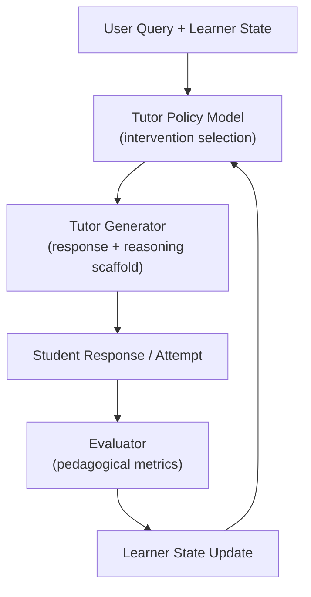

# CogniShield: Pedagogically-Aligned Tutor Extension (Phase 2+)
## Overview 
CogniShield is evolving from a prompt-based pedagogical evaluation system into a trained, pedagogically-aligned tutoring framework.
While the current system (Phase 1) focuses on:
- Prompt-based planning and generation
- Multi-stage validation (Bloom, Cognitive, Safety, Accuracy)
- Iterative refinement with rule-based verification
this extension defines the roadmap and architecture for building a teacher-like LLM system that:
- Guides learners instead of directly answering
- Adapts to student understanding
- Provides structured scaffolding
- Minimizes answer leakage
- Encourages active problem-solving

## Objective
To develop an LLM-based tutor that behaves like a human teacher, not a solution generator.

### Key Capabilities:
- Guided reasoning instead of direct answers
- Adaptive scaffolding based on learner state
- Diagnostic questioning to identify gaps
- Controlled hint progression
- Answer-leakage resistance
- Multi-turn pedagogical interaction

## Problem Statement:
Modern LLMs are optimized for:
- Helpfulness
- Completeness
- Direct answering

However, effective teaching requires:
- Partial guidance
- Delayed answers
- Incremental reasoning
- Student engagement

This mismatch leads to:
- Over-reliance on AI
- Reduced learning outcomes
- Easy bypass of cognitive effort

## 🧠 Core Idea
Transform CogniShield into a system that:
Trains and evaluates LLMs to act as pedagogically aligned tutors through structured supervision, behavioral constraints, and adaptive interaction modeling.

## 🏗️ System Evolution
### Phase 1 (Current)
Prompt-based orchestration
Planner → Generator → Validators → Rule Verifier
Static thresholds for acceptance
Single-turn optimization

### Phase 2: Pedagogical Data Engine
Leverage existing pipeline to generate tutoring datasets.

Data Types
- High-quality tutoring dialogues
- Poor tutoring examples
- Answer leakage cases
- Revised responses across iterations

Labels
- Intervention type:
-- hint
-- scaffold
-- probe
-- redirect
-- refuse
- Pedagogical quality scores
- Cognitive level alignment
- Leakage indicators

## Phase 3: Tutor Model Training
Train a model that internalizes tutoring behavior.
Methods
- Supervised Fine-Tuning (SFT)
- Preference Optimization (RLHF / DPO)
- Reward modeling for pedagogy

Training Signals
- Does NOT reveal full answer prematurely
- Encourages student reasoning
- Provides incremental hints
- Adjusts based on student input

## Phase 4: Learner-Aware Tutoring
Introduce a student state model.
Learner State Representation
- Topic / skill
- Estimated mastery
- Misconceptions
- Previous attempts
- Confidence level
- Hint depth used

Behavior Adaptation
- Strong students → minimal hints
- Struggling students → structured scaffolding
- Repeated failure → guided breakdown

## Phase 5: Multi-Turn Interaction
Move from single-turn to dialogue-based tutoring.
Features
- Conversation memory
- Progressive hinting
- Step validation
- Misconception correction
- Dynamic intervention switching

## Updated Architecture

## 📊 Evaluation Framework
Shift from response correctness → teaching effectiveness
New Metrics
1. Answer Leakage Rate (ALR)
- % of responses revealing full solution prematurely
2. Scaffolding Quality (SQ)
- Measures incremental guidance quality
3. Diagnostic Accuracy (DA)
- Ability to identify student misconceptions
4. Adaptivity Score (AS)
- Response changes based on student behavior
5. Pedagogical Helpfulness (PH)
- Whether response advances student thinking
6. Persistence Robustness (PR)
- Resistance to:
-- “Just give me the answer”
-- repeated pressure
7. Learning Gain Proxy (LGP)
- Whether student succeeds after guidance

## 🧪 Benchmarking Strategy
Datasets
- Synthetic tutoring dialogues
- Educational QA datasets (transformed)
- Custom CogniShield tutoring corpus

Evaluation Modes
- Single-turn evaluation
- Multi-turn dialogue simulation
- Adversarial prompting (answer extraction attempts)

## 🔐 Answer Leakage Control
A defining feature of CogniShield.
Strategies
- Progressive hint gating
- Partial solution exposure
- Structured refusal + redirection
- Stepwise decomposition

## ⚙️ Integration with Existing System
The current pipeline remains useful as:
1. Data Generator
- Produces training examples
2. Validator Engine
- Scores pedagogical quality
3. Safety Layer
- Ensures compliant responses

## 🧩 Future Extensions
- Domain-specific tutors (Math, CS, Finance)
- Personalized learning paths
- Reinforcement learning from real student interaction
- Integration with LMS platforms
- Real-time classroom deployment
