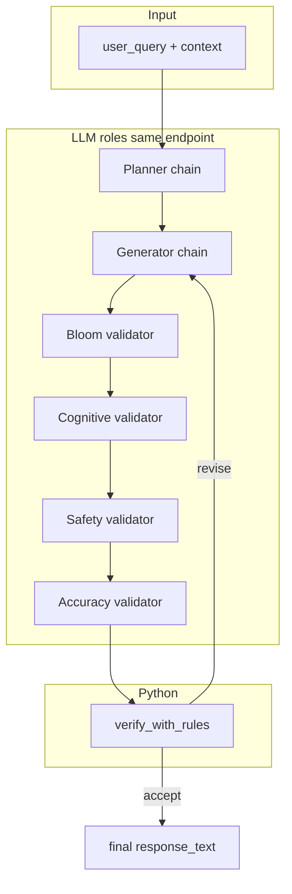

# Architecture

## High-level flow

CogniShield implements a **single-turn** pedagogical pipeline (extendable to multi-turn via `TurnContext.history`):



1. **Planner** selects an intervention (`scaffold`, `hint`, `redirect`, `defer`, `refuse`) and emits `generator_instruction`.
2. **Generator** produces `response_text` and `self_check`, optionally revised using a **backprompt** from the verifier.
3. **Validators** run **sequentially** in fixed order: Bloom → Cognitive → Safety → Accuracy. Each returns a structured `ValidatorOutput` (scores 1–5, `passed`, optional boolean flags).
4. **Verifier** (`verifier.py`) applies **deterministic thresholds** from `Settings` (no extra LLM). If any rule fires, the generator gets a generic backprompt and the loop repeats up to `max_revisions`.
5. If max revisions are exhausted, a **fallback** string is returned (`orchestrator.py`).

## Technology stack

| Layer | Choice |
|-------|--------|
| Orchestration | Plain Python loop in `orchestrator.py` (not LangGraph in v1) |
| LLM access | `langchain_openai.ChatOpenAI` + `with_structured_output(Pydantic)` |
| Config | `pydantic-settings` (`COGNISHIELD_*` env, `.env`) + **Tyro** CLI |
| Logging | `stdlib` logging, configured in `logging_setup.py` |
| Traces | Optional JSONL via `trace.py` (`JsonlTracer`) |

## OpenAI-compatible backends

`ChatOpenAI` is constructed with `model`, `temperature`, and optionally `base_url` and `api_key` from `Settings`. That supports:

- **OpenAI** (default): leave `openai_api_base` unset; set `OPENAI_API_KEY`.
- **vLLM** (or any OpenAI-compatible server): set `openai_api_base` to `http://<host>:<port>/v1` and `model` to the **served model id**. See [vllm-inference.md](vllm-inference.md).

## Repository layout (conceptual)

```
cognishield/                 # installable Python package
  app/
    chains/                  # LangChain Runnables (prompt | structured LLM)
    prompts/*.txt            # System prompts (shipped as package data)
    orchestrator.py          # Main loop + tracing hooks
    verifier.py              # Rule-based accept/revise
    settings.py              # All tunables
    cli.py                   # Tyro entrypoint
cognibench_pipeline.py       # Separate Anthropic script (dataset generation)
tests/                       # pytest
pipeline.txt                 # Original design sketch (reference)
```

## CogniBench script (separate concern)

[`cognibench_pipeline.py`](../cognibench_pipeline.py) generates **synthetic multi-turn** tutor–student JSONL using the **Anthropic API** (Claude Haiku). It does **not** use the CogniShield package or vLLM. Use it when you need benchmark **data**, not when you run the shielding pipeline.
