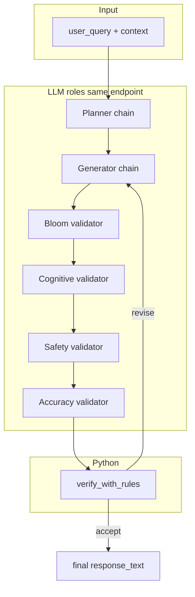
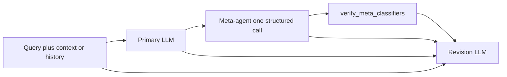

# Architecture

## Orchestration modes

`Settings.pipeline` selects which end-to-end flow runs (CLI: `--pipeline`, env: `COGNISHIELD_PIPELINE`):

| Value | Summary |
|-------|---------|
| **`legacy`** (default) | Planner → generator → four validators (Bloom, Cognitive, Safety, Accuracy) → deterministic verifier, with **revision loops** up to `max_revisions`. |
| **`meta`** | Primary tutor → **one** meta-agent structured call → deterministic meta-verifier → **always one** revision LLM. **No** planner and **no** four-validator chain on this path. |

Both modes share the same input envelope: `TurnContext` in `cognishield/app/schemas.py` (`user_query`, `history`, `learner_profile`, `rubric_constraints`, `task_context`). Multi-turn is modeled by `history` plus the latest user message in `user_query` (and prompt wording that explains that convention).

---

## Legacy pipeline (`pipeline=legacy`)

Single-turn pedagogical loop (extendable to multi-turn via `TurnContext.history`):



1. **Planner** selects an intervention (`scaffold`, `hint`, `redirect`, `defer`, `refuse`) and emits `generator_instruction`.
2. **Generator** produces `response_text` and `self_check`, optionally revised using a **backprompt** from the verifier.
3. **Validators** run **sequentially** in fixed order: Bloom → Cognitive → Safety → Accuracy. Each returns a structured `ValidatorOutput` (scores 1–5, `passed`, optional boolean flags).
4. **Verifier** (`verify_with_rules` in `verifier.py`) applies **deterministic thresholds** from `Settings` (no extra LLM). If any rule fires, the generator gets a generic backprompt and the loop repeats up to `max_revisions`.
5. If max revisions are exhausted, a **fallback** string is returned (`orchestrator.py`).

**CLI / env (legacy):**

```bash
python -m cognishield.app.cli --pipeline legacy --query "Your question"
# or omit --pipeline (default)
COGNISHIELD_PIPELINE=legacy COGNISHIELD_QUERY="Your question" python -m cognishield.app.cli
```

---

## Meta pipeline (`pipeline=meta`)

Three LLM calls per turn (primary → meta → revision), then return the **revision** output to the user.



1. **Primary** — [`primary_chain.py`](../cognishield/app/chains/primary_chain.py) builds a tutor reply from `TurnContext` fields; structured output is `GeneratorOutput` (`response_text`, `self_check`). Stored on state as `primary_draft`.
2. **Meta-agent** — Single call with the **same context** plus the primary **`response_text`**. Returns `MetaAgentOutput` in [`schemas.py`](../cognishield/app/schemas.py): `cognitive_classifier`, `safety_classifier`, `answer_classifier`, each with `level` + `reason` (see schema for allowed levels).
3. **Meta-verifier** — `verify_meta_classifiers` in [`verifier.py`](../cognishield/app/verifier.py) compares those levels to `Settings` (`meta_verifier_max_cognitive_concern`, `meta_verifier_max_safety_concern`, `meta_verifier_min_answer_quality`). Produces a `VerifierDecision` (`accept` / `revise`, reasons, optional backprompt). **No LLM.**
4. **Revision** — **Always** runs: consumes context, primary draft, JSON for meta output and verifier decision, and emits the **final** structured output (`RevisionOutput.response_text`). That string is what the CLI prints. Stored on state as `final_response_text`.

**Trace event names** (JSONL / logs): `primary`, `meta`, `verify`, `revision`.

**CLI / env (meta):**

```bash
python -m cognishield.app.cli --pipeline meta --query "Your question"
COGNISHIELD_PIPELINE=meta COGNISHIELD_QUERY="Your question" python -m cognishield.app.cli
```

**Related settings:** `temperature_meta`, `temperature_revision`, plus the `meta_verifier_*` thresholds above. **`dry_run`** branches so meta mode stubs all three LLM stages without network calls.

### Prompt files (meta pipeline)

System prompts are plain text under `cognishield/app/prompts/` (package data). Each stage loads exactly one file:

| Stage | Prompt file | Chain module |
|-------|-------------|--------------|
| Primary | [`primary.txt`](../cognishield/app/prompts/primary.txt) | [`primary_chain.py`](../cognishield/app/chains/primary_chain.py) |
| Meta-agent | [`meta_agent.txt`](../cognishield/app/prompts/meta_agent.txt) | [`meta_chain.py`](../cognishield/app/chains/meta_chain.py) |
| Revision | [`revision.txt`](../cognishield/app/prompts/revision.txt) | [`revision_chain.py`](../cognishield/app/chains/revision_chain.py) |

Legacy-only prompts remain for the other mode (e.g. `planner.txt`, `generator.txt`, `validator_*.txt`).

### Tuning behavior (especially avoiding “full solutions”)

If the **final** reply still includes step-by-step answers or submission-ready text, all three prompts participate:

- **Primary** — Sets the first draft; tighten refusal / scaffolding rules when the user asks for copy-paste homework solutions.
- **Meta-agent** — Defines how cognitive/safety/answer levels are judged; stricter definitions increase the chance the meta-verifier emits `revise` and stronger reasons for the revision step.
- **Revision** — Decides how much of the draft to keep when the verifier **accepts**; if meta scores everything “good,” revision may still polish wording while leaving a full solution unless this prompt forbids that.

The deterministic meta-verifier only gates on **ordinal levels**, not free-text reasons; deep policy lives in the prompts and in future thresholds you add to `Settings`.

## Technology stack

| Layer | Choice |
|-------|--------|
| Orchestration | Plain Python loop in `orchestrator.py` (not LangGraph in v1) |
| LLM access | `langchain_openai.ChatOpenAI` + `with_structured_output(Pydantic)` |
| Config | `pydantic-settings` (`COGNISHIELD_*` env, `.env`) + **Tyro** CLI |
| Logging | `stdlib` logging, configured in `logging_setup.py` |
| Traces | Optional JSONL via `trace.py` (`JsonlTracer`) |

## OpenAI-compatible backends

`ChatOpenAI` is constructed with `model`, `temperature`, and optionally `base_url` and `api_key` from `Settings`. That supports:

- **OpenAI** (default): leave `openai_api_base` unset; set `OPENAI_API_KEY`.
- **vLLM** (or any OpenAI-compatible server): set `openai_api_base` to `http://<host>:<port>/v1` and `model` to the **served model id**. See [vllm-inference.md](vllm-inference.md).

## Repository layout (conceptual)

```
cognishield/                 # installable Python package
  app/
    chains/                  # LangChain Runnables (prompt | structured LLM)
                             # legacy: planner, generator, validator_* ;
                             # meta: primary_chain, meta_chain, revision_chain
    prompts/*.txt            # System prompts (shipped as package data)
    orchestrator.py          # Main loop + tracing hooks
    verifier.py              # Rule-based accept/revise
    settings.py              # All tunables
    cli.py                   # Tyro entrypoint
cognibench_pipeline.py       # Separate Anthropic script (dataset generation)
tests/                       # pytest
pipeline.txt                 # Original design sketch (reference)
```

## CogniBench script (separate concern)

[`cognibench_pipeline.py`](../cognibench_pipeline.py) generates **synthetic multi-turn** tutor–student JSONL using the **Anthropic API** (Claude Haiku). It does **not** use the CogniShield package or vLLM. Use it when you need benchmark **data**, not when you run the shielding pipeline.
